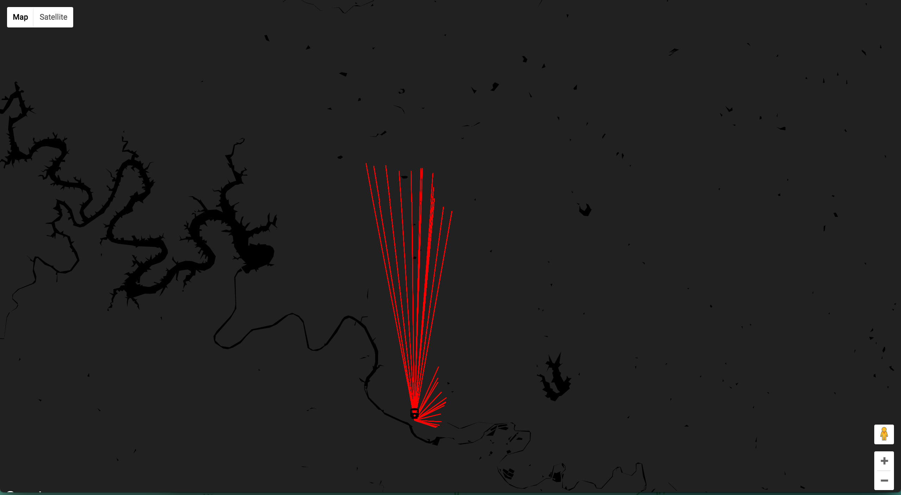

# Coming and Going

A [calm technology](https://en.wikipedia.org/wiki/Calm_technology) visualization using data points from CapMetro's 550 train line

See it live [here](https://client-lwahplxygl.now.sh/).

## Development
- Add .env.* file to the 'client' directory
- Run `yarn` in both the 'client' and 'server' directories to install the necessary packages.
- Set up the Google Cloud SDK in the 'server' directory to use the full range of commands related to development of that service.
- See the [README.md](client/README.md) in the 'client' directory for the available commands provided by create-react-app, e.g. `yarn start`.
- Run `yarn test` from either the 'client' or 'server' directories to run the tests.

## Tech Used
- Client
  - [create-react-app](https://github.com/facebookincubator/create-react-app)
  - [react-google-maps](https://www.npmjs.com/package/react-google-maps)
  - Material UI icon for [transit station](https://material.io/icons/#ic_directions_railway)
- Server
  - [Google Cloud Functions](https://cloud.google.com/functions/)
  - [Ava](https://github.com/avajs/ava)
- Node.js v8.4.0
- yarn
- Semistandard
- Zeit Now
